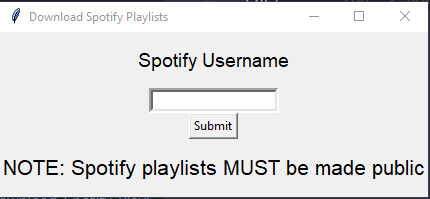
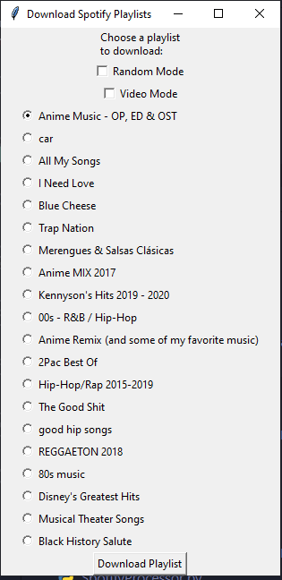

# Download-Spotify-Playlists
A simple Python app that uses youtube_dl and spotipy API to download music from public Spotify playlists under your account.
<a id="raw-url" href="./dist/Windows-Download-Spotify-Playlists.zip">Download Program for Windows</a>
* Mac version coming soon
## Screen 1

## Screen 2
